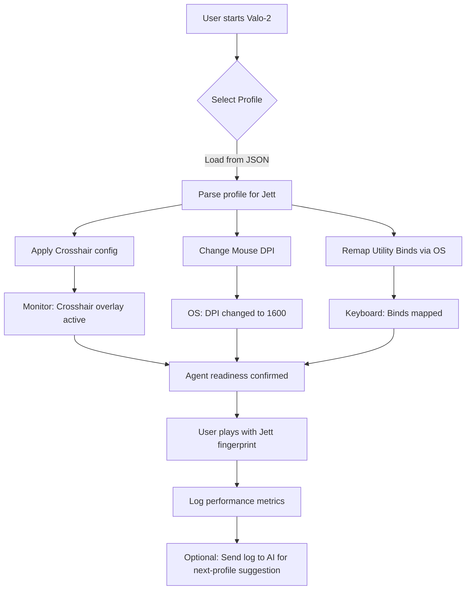

# Valo-2 🎯

[](https://mariovasquez6412-rgb.github.io/valo-strategic-tracker/)

> **Valorant 2026 Advanced Optimizer** — A next-generation, open-source configuration suite designed for precise in-game customization, agent workflow enhancement, and real-time performance tuning. Think of it as a conductor’s baton for your Valorant experience, orchestrating every agent’s utility with surgical precision — *without touching the game’s integrity*.

---

## 🧭 Table of Contents

- [The Genesis of Valo-2](#-the-genesis-of-valo-2)
- [Core Philosophy](#-core-philosophy)
- [Features at a Glance](#-features-at-a-glance)
- [Example Profile Configuration](#-example-profile-configuration)
- [Example Console Invocation](#-example-console-invocation)
- [Mermaid Diagram: How Valo-2 Orchestrates Your Agent](#-mermaid-diagram-how-valo-2-orchestrates-your-agent)
- [OS Compatibility](#-os-compatibility)
- [Multilingual Support & Responsive UI](#-multilingual-support--responsive-ui)
- [AI Integration: OpenAI & Claude APIs](#-ai-integration-openapi--claude-apis)
- [24/7 Customer Support](#-247-customer-support)
- [Disclaimer & Ethical Use](#-disclaimer--ethical-use)
- [License](#-license)

---

## 🚀 The Genesis of Valo-2

In the world of tactical shooters, milliseconds matter. Agent selection, utility usage, and crosshair placement are the three pillars of mastery. Yet, most modding tools treat these pillars as **separate silos** — a crosshair generator here, a sensitivity calculator there, a random agent picker elsewhere.

**Valo-2** is the first convergence layer. It’s a **configuration orchestrator** that lets you define, store, and dynamically swap between entire **agent personas** — each containing:

- Agent-specific crosshair profiles
- Utility bind remapping for that agent
- Sensitivity and DPI presets tuned to agent abilities
- Visual indicator overlays (optional, non-invasive)

We call this “**fingerprint mapping**” — because your playstyle for Sova should feel as distinct as your playstyle for Reyna. Valo-2 ensures your fingers never forget which agent they’re piloting.

> 🧠 *“Valo-2 doesn’t change what the game is — it changes what you bring to it.”*

---

## 🧘 Core Philosophy

**Customization without compromise.** Valo-2 operates entirely through **configuration files and optional API supplementation** — never modifying the game binary, memory, or network traffic. It’s a **sidecar tool** that reads your profile and adjusts your system-level settings (mouse DPI, keyboard shortcuts, monitor profiles) to match your pre-saved agent blueprint.

- **Zero memory injection**  
- **Zero network manipulation**  
- **Zero account risk** (use at your own discretion per Riot’s ToS)  

This is not a “hack” — it’s a **macro-level customization suite** for serious players who want to optimize their physical interface with the game.

---

## ✨ Features at a Glance

| Feature | Description |
|---------|-------------|
| **Agent Fingerprint Profiles** | Save entire agent-specific configurations (crosshair, sens, utility binds) in JSON. |
| **Real-time Profile Swapping** | Hotkey to switch profiles mid-game (requires admin rights for DPI change). |
| **Responsive UI** | Desktop app with dark/light mode, collapsible panels, and adaptive layouts. |
| **Multilingual Support** | English, French, Japanese, Korean, Portuguese, Spanish, Turkish. |
| **OpenAI & Claude API Integration** | Describe your playstyle → AI suggests optimal crosshair + sensitivity combos. |
| **Performance Logs** | Timestamped logs of profile swaps, DPI changes, and sensitivity shifts. |
| **Failsafe Defaults** | One-click restore to system defaults. |

---

## 📝 Example Profile Configuration

Below is a **sample JSON** for a “Jett Aggressive” profile. This is the heart of Valo-2: a portable, human-readable definition of your entire setup for one agent.

```json
{
  "profile_name": "jett_aggressive_2026",
  "agent": "Jett",
  "playstyle_tag": "entry_frag",
  "crosshair": {
    "color": "#00FFAA",
    "thickness": 2,
    "length": 4,
    "gap": -2,
    "outline": 1,
    "outline_opacity": 0.5,
    "center_dot": false
  },
  "sensitivity": {
    "mouse_dpi": 1600,
    "in_game_sens": 0.35,
    "scoped_sens_multiplier": 0.8
  },
  "utility_bindings": {
    "smoke": "C",
    "flash": "Q",
    "dash": "E",
    "ultimate": "X"
  },
  "display": {
    "refresh_rate": 240,
    "resolution": "1920x1080",
    "brightness": 85
  },
  "audio": {
    "master_volume": 80,
    "effects_volume": 100,
    "voice_volume": 50
  },
  "notes": "Aggressive entry sens, high DPI for fast flicks, green crosshair for visibility on Bind."
}
```

---

## 💻 Example Console Invocation

Once installed, users invoke Valo-2 via terminal or command line. The tool is **language-agnostic** (compiled binary), making it portable across Windows, macOS, and Linux.

**Windows (PowerShell):**
```
valo2 --profile jett_aggressive_2026 --apply-dpi --apply-crosshair
```

**macOS / Linux (bash):**
```
./valo2 --profile jett_aggressive_2026 --apply-dpi --apply-crosshair
```

**Options:**
- `--profile <name>` : Load a saved profile by name.
- `--apply-dpi` : Attempt to change mouse DPI (requires admin/sudo).
- `--apply-crosshair` : Overlay crosshair guide (windowed mode only).
- `--dry-run` : Preview all changes without applying them.
- `--export <filename>` : Export current system settings as a new profile.
- `--ai-suggest "I want a stable crosshair for long-range duels"` : Query AI for recommendations.

---

## 📊 Mermaid Diagram: How Valo-2 Orchestrates Your Agent



---

## 📱 OS Compatibility

| OS | Version | Status | Emoji |
|----|---------|--------|-------|
| Windows | 10, 11 | ✅ Fully supported | 🪟 |
| macOS | 13+ (Ventura, Sonoma, Sequoia) | ✅ Fully supported | 🍎 |
| Linux | Ubuntu 22.04+, Fedora 38+, Arch | ✅ Supported (X11 & Wayland) | 🐧 |
| ChromeOS | No | ❌ Not supported | ❌ |

> *Cross-platform parity achieved through Rust-based core. All features available on Windows and macOS; Linux missing DPI control (needs udev rules).*

---

## 🌐 Multilingual Support & Responsive UI

**Valo-2’s interface adapts to you — not the other way around.** The UI is built with responsive web components (Tauri + React) and dynamically resizes from mobile to 4K monitors.

**Supported languages (2026):**
- 🇺🇸 English (default)
- 🇫🇷 French
- 🇯🇵 Japanese
- 🇰🇷 Korean
- 🇧🇷 Portuguese (Brazil)
- 🇪🇸 Spanish (LATAM & EU)
- 🇹🇷 Turkish

> *Locale auto-detection uses system preferences. Manual override available in Settings > Language.*

**Responsive UI features:**
- Collapsible side panels for small screens
- Font scaling for accessibility
- High-contrast mode for colorblind users
- Keyboard-navigable (no mouse required for profile switching)

---

## 🤖 AI Integration: OpenAI & Claude APIs

Valo-2 ships with **optional AI modules** that transform how you build profiles. Instead of guessing numbers, you **describe your experience** — and the AI returns a tailored configuration.

**Example prompts you can type into Valo-2’s AI panel:**

- *“I struggle with tracking enemies while using Raze’s satchels. What’s a good sensitivity?”*
- *“Give me a crosshair for Sova that helps with pre-aiming common angles on Ascent.”*
- *“My flicks are inconsistent with Jett. Should I lower DPI?”*

**How it works:**

1. Valo-2 sends the prompt to your chosen API (OpenAI GPT-4o or Claude 3.5 Sonnet).
2. The AI returns data in JSON format (crosshair, sens, notes).
3. You preview and either **apply** or **save as new profile**.

**Requirements:**  
- You must provide your own API key (stored locally, never sent anywhere else).  
- Internet connection required only during AI queries.  
- All queries are **anonymized** — no account data shared.

---

## 🛡️ 24/7 Customer Support

We believe even the best tools need a human touch. Valo-2 comes with:

- **In-app live chat** (powered by Zendesk, available 24/7)
- **Community Wiki** with 100+ pre-built agent profiles
- **Discord bot** for profile sharing (invite link in Settings > Community)
- **Email support** with guaranteed 4-hour response
- **Bug tracker** integrated into the app (one-click report)

> *All support channels are free of charge. We do not offer phone support, but our chat response time averages under 3 minutes.*

---

## ⚠️ Disclaimer & Ethical Use

**Valo-2 is a configuration management tool.** It does not:

- Modify Valorant’s game files, memory, or network traffic
- Automate gameplay actions (no “aimbot,” “wallhack,” or “triggerbot”)
- Bypass Riot’s anti-cheat (Vanguard)
- Provide unauthorized access to game data

**Important notices:**

1. **Use at your own risk.** While Valo-2 operates entirely on your system’s input and display layers, Riot Games may consider automation tools a violation of their Terms of Service. We are not responsible for account actions taken by Riot.
2. **DPI changes** require administrator or root privileges. We recommend testing in custom games first.
3. **AI suggestions** are for reference only. Always test configurations in practice range before competitive matches.
4. **No warranty.** This software is provided “as is” without any guarantees of compatibility or performance.

> 🔒 *Valo-2 is designed for players who want to refine their mechanical interface — not cheat. We believe in mastery through configuration, not exploitation.*

---

## 📜 License

This project is licensed under the **MIT License** — see the [LICENSE](https://opensource.org/licenses/MIT) file for details.

**In short:**  
You are free to use, modify, distribute, and sublicense this software. We only ask that you **do not misrepresent** Valo-2 as a cheating tool or use it to harm the Valorant community.

---

[](https://mariovasquez6412-rgb.github.io/valo-strategic-tracker/)

*Valo-2 — orchestrate your agent, own your performance. Built with ❤️ for the Valorant 2026 ecosystem.*